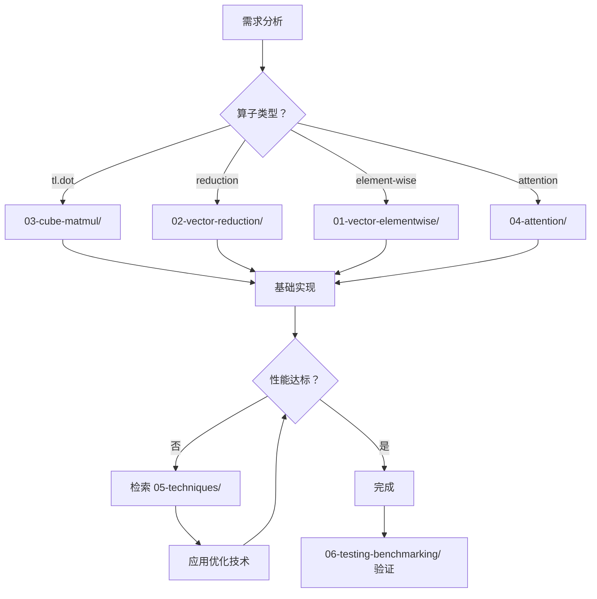

# Triton Ascend 代码模板库

本目录包含可靠代码模板，用于快速生成和验证 Ascend NPU 算子。

## 📁 目录结构

```
templates/
├── 00-README.md                    # 总索引（本文件）
├── 01-vector-elementwise/          # 逐元素操作（无 tl.dot）
│   ├── vector-add.md               # 向量加法
│   ├── activation-functions.md     # 激活函数（GELU, SiLU, ReLU）
│   └── comparison-ops.md           # 比较操作（>, <, ==）
├── 02-vector-reduction/            # 归约操作（需要 reduce）
│   ├── layer-norm.md               # LayerNorm
│   ├── softmax.md                  # Softmax
│   └── reduce-sum.md               # Reduce Sum
├── 03-cube-matmul/                 # 矩阵乘法（使用 tl.dot）
│   ├── simple-matmul.md            # 基础矩阵乘法
│   ├── matmul-with-bias.md         # 带 Bias 的 MatMul
│   ├── batched-matmul.md           # Batch MatMul
│   └── l0-constraints.md           # L0 约束计算和验证
├── 04-attention/                   # Attention 算子
│   ├── decode-grouped-attention.md # Decode 阶段的 Grouped Attention
│   └── flash-attention.md          # Flash Attention
├── 05-techniques/                  # 优化技术
│   ├── gather-scatter.md           # Gather/Scatter 模式
│   ├── tiling.md                   # Tiling 策略
│   ├── buffer-management.md        # UB/L0 管理
│   ├── large-shape-handling.md     # 大 Shape 处理
│   └── core-number-strategies.md   # 固定核心数启动
└── 06-testing-benchmarking/        # 测试和性能
    ├── test-template.md            # 测试模板
    └── benchmark-template.md       # 性能测试模板
```

## 🔍 检索指南

### 第一阶段：基础算子检索

当需要实现某个算子时，首先按**算子类型**检索：

| 搜索关键词 | 定位目录 | 示例模板 |
|-----------|---------|---------|
| "向量加法", "element-wise" | `01-vector-elementwise/` | `vector-add.md` |
| "激活函数", "gelu", "silu" | `01-vector-elementwise/` | `activation-functions.md` |
| "layer norm", "normalization" | `02-vector-reduction/` | `layer-norm.md` |
| "softmax" | `02-vector-reduction/` | `softmax.md` |
| "矩阵乘法", "matmul", "tl.dot" | `03-cube-matmul/` | `simple-matmul.md` |
| "attention", "decode" | `04-attention/` | `decode-grouped-attention.md` |

### 第二阶段：优化技术检索

当基础实现完成后，如需优化性能，检索**技术分类**：

| 搜索关键词 | 定位目录 | 示例模板 |
|-----------|---------|---------|
| "gather", "scatter", "索引" | `05-techniques/` | `gather-scatter.md` |
| "tiling", "分块", "循环" | `05-techniques/` | `tiling.md` |
| "UB 溢出", "L0 约束", "buffer" | `05-techniques/` | `buffer-management.md` |
| "大 shape", "超过限制" | `05-techniques/` | `large-shape-handling.md` |
| "核心数", "固定核心", "grid" | `05-techniques/` | `core-number-strategies.md` |

## 🎯 算子类型识别

在查找模板前，先判断算子类型：

```python
# 1. 是否是 Attention 相关？
#    - 是 → 04-attention/

# 2. 是否使用 tl.dot？
#    - 是 → Cube 算子 → 03-cube-matmul/
#    - 否 → Vector 算子 → 继续判断

# 3. 是否有归约操作（tl.sum, tl.max 等）？
#    - 是 → Reduction 算子 → 02-vector-reduction/
#    - 否 → Element-wise 算子 → 01-vector-elementwise/
```

## 📊 硬件约束速查

### Vector 算子（UB 约束）

| 约束 | 限制 | 说明 |
|------|------|------|
| UB 容量 | ≤ 85KB/循环 | 单次循环 UB 占用（启用 Double Buffering） |
| Block 大小 | < 65536 | 最大元素数 |
| Vector Core | 40-48 | 获取方式：`torch_npu.npu.npu_config.get_device_limit(0).get("vector_core_num", 40)` |

### Cube 算子（L0 约束）

| 约束 | 限制 | 说明 |
|------|------|------|
| L0A 容量 | ≤ 64KB | 左矩阵 A (m0×k0) |
| L0B 容量 | ≤ 64KB | 右矩阵 B (k0×n0) |
| L0C 容量 | ≤ 128KB | 结果矩阵 C (m0×n0) |
| Cube Core | 20-24 | 获取方式：`torch_npu.npu.npu_config.get_device_limit(0).get("cube_core_num", 20)` |

## 🔧 核心数获取

```python
import torch_npu

try:
    # Vector Core 数
    VECTOR_CORE_NUM = torch_npu.npu.npu_config.get_device_limit(0).get("vector_core_num", 40)
except:
    VECTOR_CORE_NUM = 40

try:
    # Cube Core 数
    CUBE_CORE_NUM = torch_npu.npu.npu_config.get_device_limit(0).get("cube_core_num", 20)
except:
    CUBE_CORE_NUM = 20
```

## ⚠️ Ascend 特定注意事项

### 1. 比较操作类型限制

Ascend NPU 不支持 int32/int64 的比较操作，会导致回退到标量计算：

```python
# ❌ 错误：int64 比较
cols = tl.arange(0, BLOCK_N)  # 默认 int64
mask = cols < N  # 回退到标量

# ✅ 正确：转换为 float32 后比较
cols = tl.arange(0, BLOCK_N)
cols_f32 = cols.to(tl.float32)
mask = cols_f32 < N  # 向量化比较
```

### 2. 访存模式亲和性

Ascend 对某些访存模式更亲和：

```python
# ✅ Ascend 亲和：连续索引 + 离散数据
# 低纬连续、高纬离散的访存
offs_buf = kv_loc[:, None] * stride_buf_bs + offs_d[None, :]
data = tl.load(buffer + offs_buf, mask=mask)

# ⚠️ Ascend 不亲和：离散索引
# 需要使用 tl.get_element / tl.insert_slice
for i in range(BLOCK_N):
    idx = tl.get_element(kv_loc, (i,))
    val = tl.load(buffer + idx * stride)
```

### 3. Grid 限制

当 grid 总大小超过 65535 时，需要使用固定核心数 + 交错循环：

```python
# ✅ 推荐：固定核心数启动
num_cores = 40
grid = (num_cores,)

# kernel 内部
for i in range(pid, total_items, num_cores):
    # 处理第 i 个元素
```

## 🔄 使用流程


